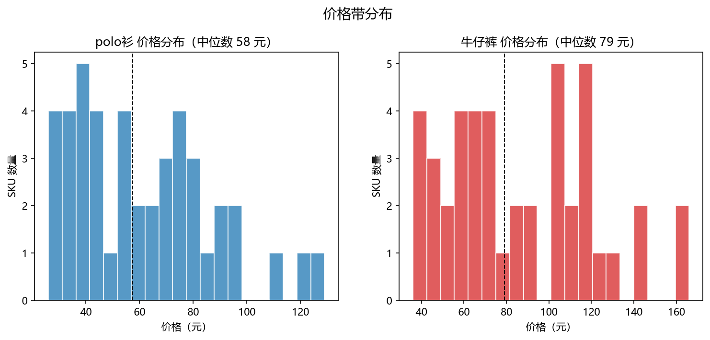
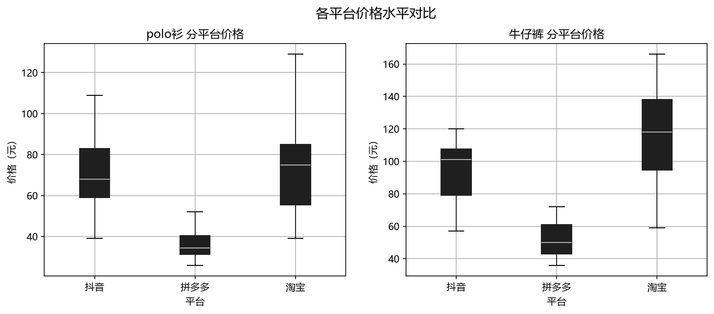
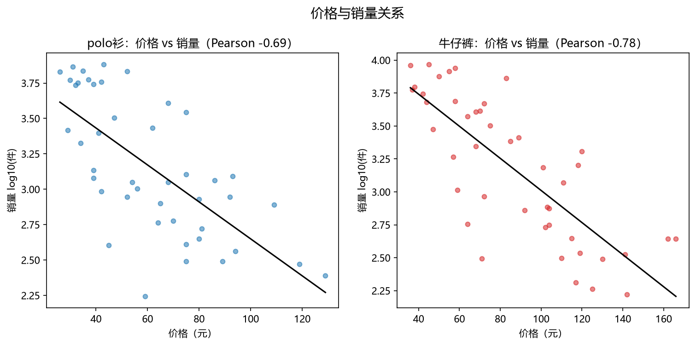
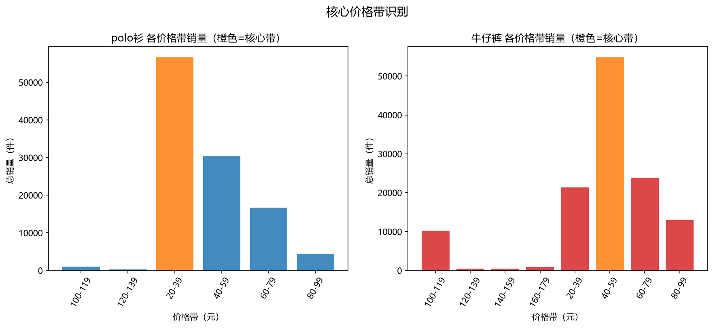

# 电商竞品价格与销量分析报告

> 生成时间：2026-08-19T22:16:39

> 品类：Polo 衫、牛仔裤　|　平台：淘宝 / 拼多多 / 抖音

## 一、数据说明

- 采集范围：2 个品类 × 3 个平台，共 **88** 个 SKU。

- 数据来源：`crawled`（真实抓取）与 `reference`（参考估测，用于被风控拦截时的兜底），来源字段已在明细数据中标注，本报告结论仅供定价参考。

## 二、价格与销量相关性

| 品类 | Pearson | Spearman | 样本数 |
|---|---|---|---|
| Polo 衫 | -0.689 | -0.708 | 44 |
| 牛仔裤 | -0.782 | -0.805 | 44 |

> 相关系数为负表示「价格越低、销量越高」，绝对值越大关系越强。

## 三、核心价格带

| 品类 | 核心价格带 | 销量占比 | 平均销量 | SKU 数 |
|---|---|---|---|---|
| Polo 衫 | 20–39 元 | 51.8% | 4724 件 | 12 |
| 牛仔裤 | 40–59 元 | 43.8% | 5486 件 | 10 |

## 四、定价建议（可执行）

### Polo 衫

- **引流款**：定价 **39 元**（核心带下沿，冲销量、抢流量）。
- **主推款**：定价 **58 元**（贴近品类中位数，走量兼利润）。
- **利润款**：定价 **76 元**（核心带上沿，毛利空间更大）。
- 整体参考区间：**39–76 元**。

### 牛仔裤

- **引流款**：定价 **58 元**（核心带下沿，冲销量、抢流量）。
- **主推款**：定价 **79 元**（贴近品类中位数，走量兼利润）。
- **利润款**：定价 **112 元**（核心带上沿，毛利空间更大）。
- 整体参考区间：**58–112 元**。

## 五、图表

## 六、局限与说明

- 抖音/淘宝/拼多多均有登录态与签名风控，真实抓取被拦截的部分已用参考估测数据补齐，结论为方法演示，不构成真实经营建议。

- 销量口径在各平台不完全一致（件/月 vs 总销量），已统一按「近 30 天销量」近似处理。
